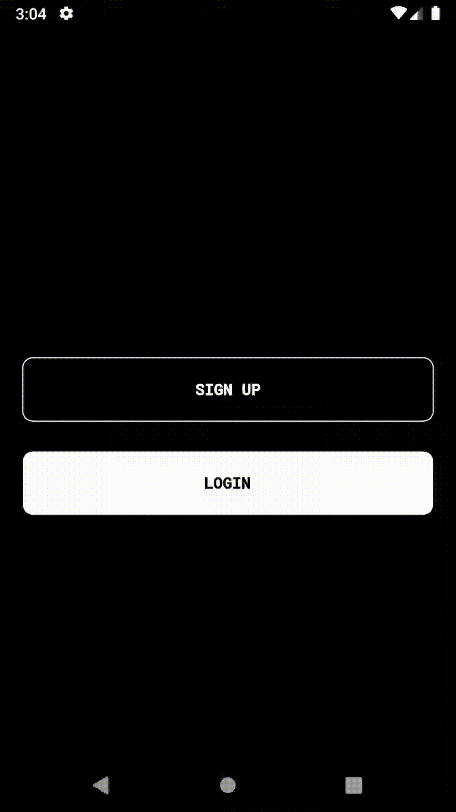
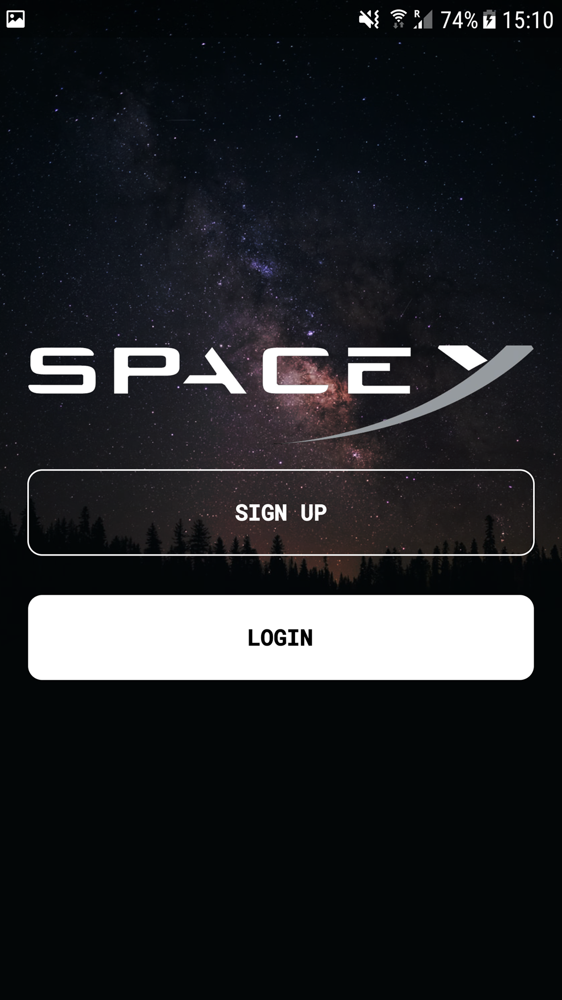
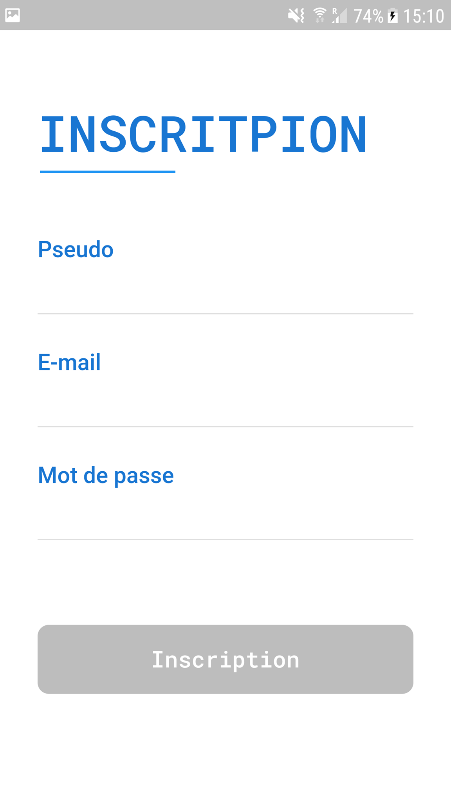
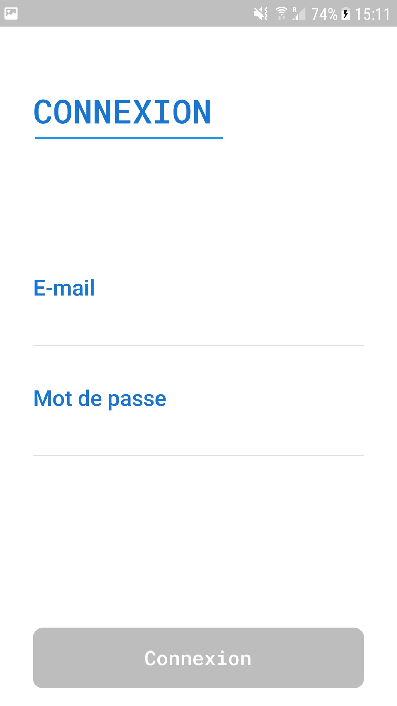
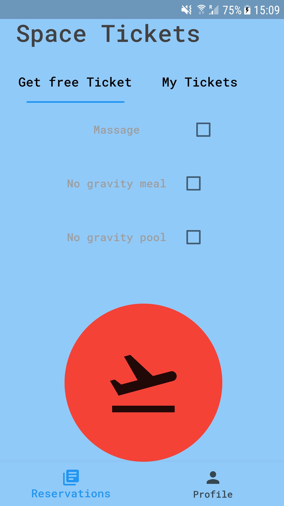
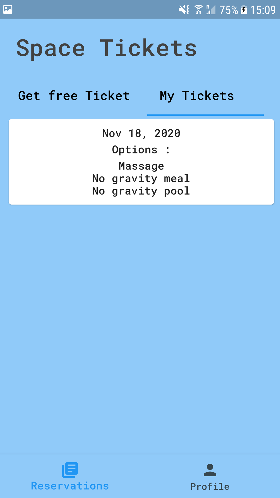
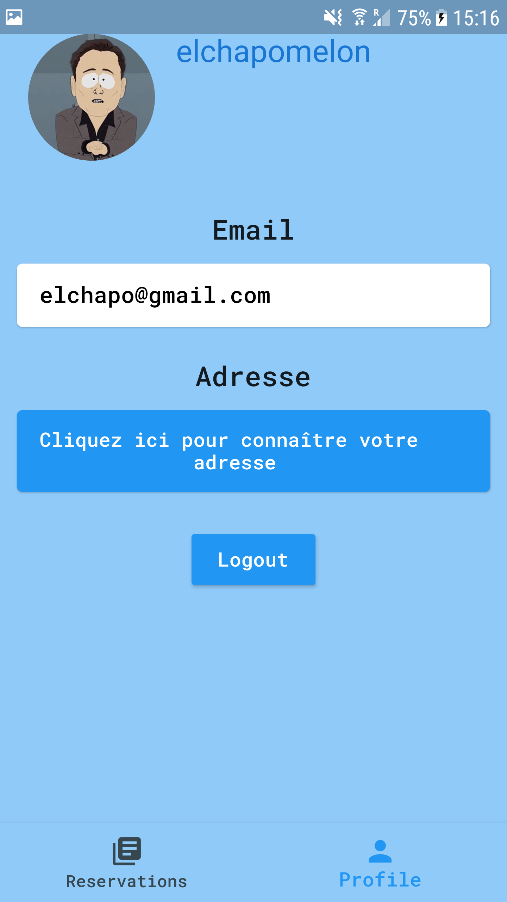
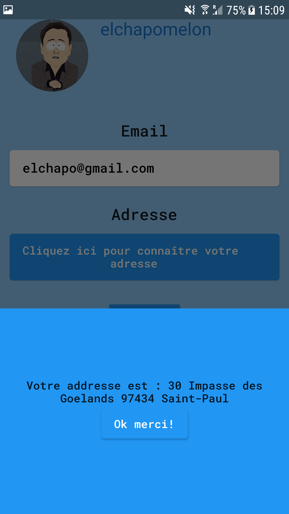

La célèbre entreprise à but très lucrative vous offre un ticket pour l'espace!
## Instructions
* flutter pub get && flutter run

## Sujet
L'application réalise des requêtes HTTP vers une API afin de :
* S'inscrire (username, email, password)
* Se connecter (attribution d'un token)
* Acheter un ticket avec des options (siège massant, repas sans gravité, <a href="https://youtu.be/qeaiVveZWD8?t=31">piscine sans gravité</a>)
* Lister les tickets achetés
* Connaître sa position ou son adresse (les coordonnées GPS s'affichent si aucune adresse n'a été retourné par l'API du gouvernement)
* Se déconnecter

## Les fonctionnalités
* Gestionnaire de session avec token
* Utilisation du GPS du téléphone afin de récupérer la position
* Requêtes POST & GET afin de créer un utilisateur, récupérer ses informations, créer une demande de ticket, afficher les tickets
* Flutter drive test (Inscription, connexion, déconnexion, créer un ticket et vérifier sa présence)
* Utilisation de l'architecture BloC

### Exemple d'un flutter drive test ci-dessous

### Captures d'écran de l'application

